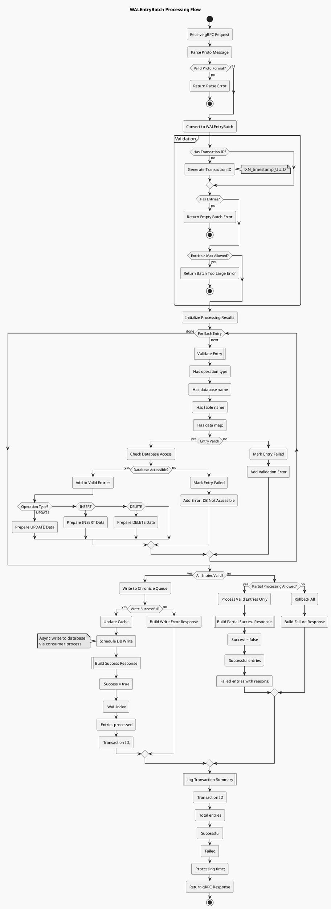

# Chronicle Queue System - PlantUML Flow Diagrams

## 1. Producer Workflow - Writing to Chronicle Queue

```plantuml
@startuml Producer_Workflow
!theme mars
title Producer Workflow - Writing to Chronicle Queue

start

:Receive Operation Request;
note right
  Could be:
  - gRPC request
  - Kafka message
  - Direct API call
end note

:Create WALEntryBatch;
note left
  Single atomic unit with:
  - Transaction ID
  - Multiple WAL entries
  - Timestamp
end note

if (Is Batch Empty?) then (yes)
  :Log Warning;
  :Return Error Response;
  stop
else (no)
endif

:Generate Transaction ID if missing;
note right: TXN_timestamp_UUID

:Acquire Write Lock;

partition "Write to WAL" {
  :Get ExcerptAppender;
  
  :Begin Document Write;
  
  :Write Transaction Metadata|
  - Transaction ID
  - Batch Size
  - Timestamp;
  
  :Initialize Entry Counter;
  
  while (More Entries in Batch?) is (yes)
    :Get Next Entry;
    
    :Write Entry Type;
    note right: INSERT/UPDATE/DELETE
    
    :Write Database Name;
    
    :Write Table Name;
    
    :Write Entry Data;
    note left
      Map<String, Object>
      Serialized as wire format
    end note
    
    :Increment Counter;
  endwhile (no)
  
  :Complete Document Write;
  
  :Get WAL Index;
  note right: Position in queue
}

:Release Write Lock;

if (Write Successful?) then (yes)
  :Update In-Memory Cache;
  
  partition "Cache Update" {
    while (For Each Entry) is (next)
      :Get Database Cache;
      
      if (Operation Type?) then (UPDATE)
        :Update Entity in Cache;
      elseif (INSERT)
        :Add Entity to Cache;
      elseif (DELETE)
        :Remove Entity from Cache;
      else
        :Log Unknown Operation;
      endif
    endwhile (done)
  }
  
  :Log Success|
  Transaction: {txnId}
  Entries: {count}
  Index: {walIndex};
  
  :Return Success Response;
  note right
    Response includes:
    - Success flag
    - WAL index
    - Entries processed
    - Timestamp
  end note
  
else (no)
  :Log Error;
  
  :Rollback Cache Changes;
  
  if (Retry Possible?) then (yes)
    :Increment Retry Counter;
    
    if (Retries < Max?) then (yes)
      :Wait Backoff Period;
      note left: Exponential backoff
      
      -> Retry;
      :Acquire Write Lock;
    else (no)
      :Return Failure Response;
      note right: Max retries exceeded
    endif
  else (no)
    :Return Failure Response;
  endif
endif

stop

@enduml
```

## 2. Consumer Workflow - Reading from Chronicle Queue

```plantuml
@startuml Consumer_Workflow
!theme mars
title Consumer Workflow - Reading from Chronicle Queue

start

:Initialize Consumer;
note right
  - Create ExcerptTailer
  - Set starting position
  - Initialize metrics
end note

if (Startup Mode?) then (yes)
  :Set Tailer to Start;
  :Set Replay Mode = true;
else (no)
  :Set Tailer to End;
  :Set Replay Mode = false;
endif

:Initialize Processing State|
- Last successful index
- Error counter
- Skip counter;

while (Is Running?) is (yes)
  
  :Check Tailer Position;
  
  if (Has Data to Read?) then (yes)
    
    partition "Read Entry" {
      :Begin Read Document;
      
      if (Can Parse Document?) then (yes)
        :Extract Transaction ID;
        :Extract Batch Size;
        :Extract Timestamp;
        
        :Initialize Batch Processing;
        
        while (More Entries in Batch?) is (yes)
          :Read Entry Type;
          :Read Database Name;
          :Read Table Name;
          :Read Entry Data;
          
          if (Entry Valid?) then (yes)
            :Add to Processing Queue;
          else (no)
            :Log Invalid Entry;
            :Increment Skip Counter;
          endif
          
        endwhile (no)
        
      else (no)
        #pink:Corruption Detected;
        note right: Jump to corruption handling
        
        :Log Corruption at Index;
        
        if (Can Skip Entry?) then (yes)
          :Move to Next Index;
          :Increment Skip Counter;
        else (no)
          if (Can Find Next Valid?) then (yes)
            :Jump to Next Valid;
            :Log Entries Skipped;
          else (no)
            if (Replay Mode?) then (yes)
              :Log Fatal Error;
              :Mark Replay Failed;
              break
            else (no)
              :Jump to End;
              :Log Major Skip;
              :Alert Operations;
            endif
          endif
        endif
      endif
    }
    
    if (Batch Ready?) then (yes)
      
      partition "Process Batch" {
        :Begin Database Transaction;
        
        while (For Each Entry) is (next)
          :Get Entry from Queue;
          
          if (Operation Type?) then (UPDATE)
            :Generate UPDATE SQL;
            :Execute UPDATE;
          elseif (INSERT)
            :Generate INSERT SQL;
            :Execute INSERT;
          elseif (DELETE)
            :Generate DELETE SQL;
            :Execute DELETE;
          else
            :Log Unknown Operation;
          endif
          
          if (SQL Successful?) then (yes)
            :Update Cache;
          else (no)
            :Log SQL Error;
            :Mark Entry Failed;
          endif
          
        endwhile (done)
        
        if (All Entries Successful?) then (yes)
          :Commit Transaction;
          :Update Last Success Index;
          :Reset Error Counter;
        else (no)
          :Rollback Transaction;
          :Increment Error Counter;
          
          if (Error Counter > Threshold?) then (yes)
            :Enter Degraded Mode;
            :Alert Operations;
          endif
        endif
      }
      
      :Log Batch Processed|
      Transaction: {txnId}
      Success: {count}
      Failed: {failed};
      
    endif
    
  else (no)
    if (Replay Mode?) then (yes)
      :Replay Complete;
      :Switch to Runtime Mode;
      :Set Replay Mode = false;
      :Move Tailer to End;
    else (no)
      :Sleep 10ms;
      note left: Wait for new data
    endif
  endif
  
  :Update Metrics|
  - Entries processed
  - Entries skipped
  - Current lag
  - Processing rate;
  
endwhile (no)

:Shutdown Consumer;
:Close Resources;
:Log Final Statistics;

stop

@enduml
```

## 3. Corruption Recovery Workflow

```plantuml
@startuml Corruption_Recovery
!theme mars
title Corruption Recovery Workflow

start

:Corruption Detected;
note right
  Could occur during:
  - Startup replay
  - Runtime consumption
end note

:Log Corruption Details|
- Index position
- Error message
- Stack trace;

:Save Current Position;

if (Is Startup Replay?) then (yes)
  
  partition "Startup Recovery" {
    :Get Last Checkpoint;
    
    if (Checkpoint Exists?) then (yes)
      :Get Checkpoint Index;
      
      if (Checkpoint > Current?) then (yes)
        :Use Checkpoint;
        note right: More recent data
      else (no)
        :Use Current Position;
      endif
    else (no)
      :No Checkpoint Available;
    endif
    
    :Attempt Progressive Skip;
    
    while (Skip Attempts < Max) is (yes)
      :Calculate Jump Size|
      1, 10, 100, 1000, 10000;
      
      :Try Move to Index;
      
      if (Can Read at Index?) then (yes)
        :Skip Successful;
        :Log Entries Skipped;
        break
      else (no)
        :Increment Skip Size;
      endif
    endwhile (no)
    
    if (Skip Failed?) then (yes)
      #pink:Critical Failure;
      
      if (Accept Data Loss?) then (yes)
        :Jump 1M Entries;
        :Log Major Loss;
        :Continue Replay;
      else (no)
        :Stop Application;
        :Require Manual Intervention;
        stop
      endif
    endif
  }
  
else (no)
  
  partition "Runtime Recovery" {
    :Record Corruption Event;
    
    :Check Consecutive Errors;
    
    if (Same Index as Last Error?) then (yes)
      :Increment Error Counter;
      
      if (Counter >= 3?) then (yes)
        :Confirmed Corruption;
      else (no)
        :Wait 100ms;
        :Retry Read;
      endif
    else (no)
      :Reset Error Counter;
      :New Error Position;
    endif
    
    if (Confirmed Corruption?) then (yes)
      :Try Skip Single Entry;
      
      if (Skip Successful?) then (yes)
        :Continue Processing;
      else (no)
        :Try Find Next Valid;
        
        while (Search Distance < 100) is (yes)
          :Check Next Position;
          
          if (Valid Entry Found?) then (yes)
            :Jump to Valid;
            break
          else (no)
            :Increment Search;
          endif
        endwhile (no)
        
        if (No Valid Found?) then (yes)
          #pink:Severe Corruption;
          
          :Create Emergency Checkpoint;
          
          :Jump to End of Queue;
          
          :Alert Operations Team;
          note right
            Send alert with:
            - Corruption index
            - Entries lost
            - Action taken
          end note
        endif
      endif
    endif
  }
endif

:Update Loss Tracking|
INSERT INTO chronicle_data_loss
- loss_type
- start_index  
- estimated_loss
- recovery_action;

if (Loss Percentage > Threshold?) then (yes)
  :Trigger High Loss Alert;
  :Send Notification|
  - Loss percentage
  - Total entries lost
  - Time period;
endif

:Log Recovery Complete;
:Resume Normal Processing;

stop

@enduml
```

## 4. WALEntryBatch Processing Flow



## 5. Cache Initialization and Replay Flow

```plantuml
@startuml Cache_Initialization
!theme mars
title Cache Initialization and Replay Flow

start

:Application Startup;

:Initialize DataSource;

:Initialize Chronicle Queue;

if (Queue Exists?) then (yes)
  :Open Existing Queue;
  
  if (Check Queue Integrity?) then (failed)
    #pink:Queue Corrupted;
    
    :Log Corruption;
    
    if (Can Archive?) then (yes)
      :Archive Corrupted Queue;
      :Create New Queue;
    else (no)
      :Fatal Error;
      stop
    endif
  else (passed)
    :Queue Valid;
  endif
else (no)
  :Create New Queue;
endif

:Initialize Cache Structure;
note right
  ConcurrentHashMap<String, 
    ConcurrentHashMap<Long, Entity>>
end note

partition "Database Discovery" {
  :Query Admin Database;
  
  :Get List of Databases;
  
  while (For Each Database) is (next)
    :Create Database Cache;
    :Add to Multi-tenant Map;
  endwhile (done)
}

partition "Load from Database" {
  while (For Each Database) is (next)
    
    :Connect to Database;
    
    if (Connection Successful?) then (yes)
      
      :Execute Load Query|
      SELECT * FROM entity_table;
      
      while (For Each Row) is (next)
        :Create Entity Object;
        :Add to Cache;
        :Increment Counter;
      endwhile (done)
      
      :Log Load Complete|
      Database: {name}
      Entities: {count};
      
    else (no)
      :Log Connection Error;
      :Mark Database Unavailable;
    endif
    
  endwhile (done)
}

:Start WAL Replay;

partition "WAL Replay" {
  :Create ExcerptTailer;
  :Move to Start;
  
  :Get Queue Length;
  
  if (Queue Empty?) then (yes)
    :No Replay Needed;
  else (no)
    
    while (Not at End?) is (yes)
      
      if (Read Entry?) then (success)
        
        :Parse WAL Entry;
        
        :Apply to Cache|
        - Update entities
        - Add new entities
        - Remove deleted;
        
        :Update Progress|
        Current: {index}
        Total: {length}
        Percent: {percent}%;
        
        if (Progress Interval?) then (yes)
          :Log Progress;
        endif
        
      else (failed)
        :Handle Corruption;
        -> See Corruption Recovery;
        
        if (Can Continue?) then (yes)
          :Skip Entry;
        else (no)
          break
        endif
      endif
      
    endwhile (no)
    
  endif
  
  :Log Replay Complete|
  Total: {processed}
  Skipped: {skipped}
  Time: {duration}ms;
}

:Start Checkpoint Scheduler;

:Start Consumer Thread;

:Mark Cache Ready;

:Log Initialization Complete;

stop

@enduml
```

## 6. Multi-Database Transaction Flow

```plantuml
@startuml Multi_Database_Transaction
!theme mars
title Multi-Database Transaction Flow (OP1 Pattern)

start

:Receive Multi-DB Operation;
note right
  Example: OP1 Pattern
  - Update account in DB1
  - Insert reserve in DB1
  - Update account in DB2
  - Insert reserve in DB2
  - Update account in DB3
  - Insert reserve in DB3
end note

:Create WALEntryBatch;
:Generate Single Transaction ID;

partition "Build Batch" {
  while (For Each Database) is (next)
    
    :Set Current Database;
    
    :Create UPDATE Entry|
    - Database name
    - Table: packageaccount
    - Operation: UPDATE
    - Data: {accountId, amount};
    
    :Add to Batch;
    
    :Create INSERT Entry|
    - Database name
    - Table: packageaccountreserve
    - Operation: INSERT
    - Data: {id, accountId, amount, session};
    
    :Add to Batch;
    
  endwhile (done)
}

:Validate Batch|
- 6 entries (3 DBs × 2 ops)
- All have same transaction ID
- All have required fields;

if (Validation Passed?) then (no)
  :Return Validation Error;
  stop
else (yes)
endif

:Write Atomic Batch to WAL;

if (WAL Write Success?) then (yes)
  
  partition "Update Caches" {
    while (For Each Entry) is (next)
      
      :Get Database Cache;
      
      :Get Entity Cache;
      
      :Apply Operation;
      
      if (Cache Update Success?) then (yes)
        :Mark Entry Success;
      else (no)
        :Log Cache Error;
        :Mark Entry Failed;
      endif
      
    endwhile (done)
  }
  
  if (All Cache Updates Success?) then (yes)
    :Return Success Response;
  else (no)
    :Return Partial Success;
    note right
      Some cache updates failed
      but WAL write succeeded
    end note
  endif
  
else (no)
  :Log WAL Write Error;
  :Return Failure Response;
endif

:Log Transaction Complete|
Transaction ID: {txnId}
Databases: {db1, db2, db3}
Total Entries: 6
Status: {status};

stop

@enduml
```

## Usage Instructions

These PlantUML diagrams can be rendered using:
1. **PlantUML Online Server**: http://www.plantuml.com/plantuml/
2. **VS Code Extension**: PlantUML extension
3. **IntelliJ IDEA**: PlantUML integration plugin
4. **Command Line**: `java -jar plantuml.jar <filename>`

To modify these diagrams:
- Add more decision points using `if/then/else`
- Add loops using `while/endwhile`
- Add parallel processing using `fork/fork again/end fork`
- Add swim lanes using `|Lane Name|`
- Add notes using `note left/right: text`
- Change colors using `#colorname:` prefix