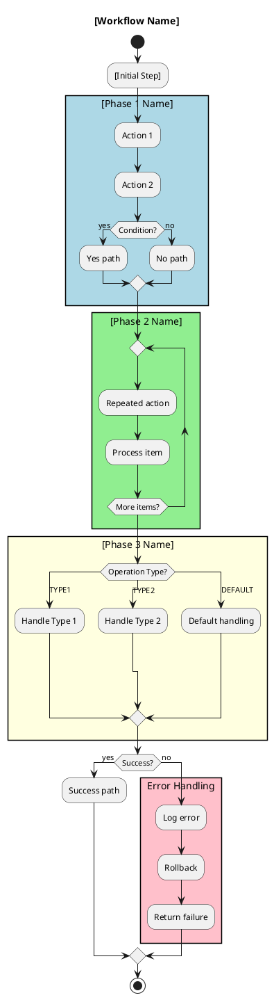

# Claude UML Diagram Creation Instructions

## 🎯 Purpose
This document contains instructions for Claude (or any AI assistant) to create and maintain PlantUML diagrams for the Chronicle Queue system. Paste these instructions when requesting UML diagram creation or updates.

---

## 📋 INSTRUCTIONS FOR CLAUDE

### Core Requirements

1. **Use PlantUML Activity Diagram Syntax**
   - Start with `@startuml` and end with `@enduml`
   - NO themes (`!theme` directive not supported)
   - Use simple, compatible syntax only

2. **Keep Diagrams Concise**
   - Maximum 50-60 lines per diagram
   - Group related steps in colored rectangles
   - Avoid verbose step-by-step details

3. **Use Rectangle Blocks for Grouping**
   ```plantuml
   rectangle "Block Name" #ColorCode {
     :Step 1;
     :Step 2;
     if (condition?) then (yes)
       :Action;
     endif
   }
   ```

4. **Color Coding Standards**
   - `#LightBlue` - Initialization/Validation/Preparation
   - `#LightGreen` - Core Processing/Main Operations
   - `#LightYellow` - Cache/Database Updates
   - `#LightCyan` - Service/Component Startup
   - `#Pink` - Error Handling/Recovery
   - `#LightGray` - Shutdown/Cleanup

5. **Syntax Rules**
   - Use `repeat...repeat while` instead of `while...endwhile`
   - Use `switch/case` for multiple conditions
   - NO multi-line with pipe `|` character
   - NO `partition` blocks
   - NO backward references with `->`
   - Simple notes only: `note left:` or `note right:`

6. **File Organization**
   - Place all `.puml` files in `docs/uml/` directory
   - Use lowercase with underscores: `producer_workflow.puml`
   - One workflow per file

---

## 📝 TEMPLATE FOR NEW DIAGRAM



---

## 🔧 COMMON PATTERNS

### Loop Pattern
```plantuml
repeat
  :Process item;
  :Update state;
repeat while (Continue?)
```

### Error Recovery Pattern
```plantuml
rectangle "Error Handling" #Pink {
  if (Can Retry?) then (yes)
    :Wait and retry;
  else (no)
    :Log and fail;
  endif
}
```

### Multi-Database Pattern
```plantuml
rectangle "Multi-DB Operations" #LightGreen {
  repeat
    :Select database;
    :Execute operation;
    :Update cache;
  repeat while (More databases?)
}
```

---

## 📊 EXISTING DIAGRAMS TO MAINTAIN

1. **producer_workflow.puml** - Writing to Chronicle Queue
2. **consumer_workflow.puml** - Reading and processing from queue
3. **corruption_recovery.puml** - Handling corrupted entries
4. **walentrybatch_processing.puml** - gRPC to WAL processing
5. **cache_initialization.puml** - Startup and cache loading
6. **multi_database_transaction.puml** - OP1 pattern (6 entries, 3 DBs)
7. **system_overview.puml** - High-level architecture

---

## ✅ CHECKLIST FOR DIAGRAM CREATION

- [ ] Diagram is under 60 lines
- [ ] Uses rectangle blocks for grouping
- [ ] Color coding follows standards
- [ ] No unsupported syntax used
- [ ] File placed in `docs/uml/`
- [ ] Descriptive title included
- [ ] Works in PlantUML online playground
- [ ] Major phases are clearly separated
- [ ] Error paths are marked in pink
- [ ] Loops use `repeat...repeat while`

---

## 🚫 AVOID THESE

1. **DON'T use:**
   - `!theme` directives
   - `partition` blocks
   - Multi-line with `|` character
   - `while...endwhile` loops
   - `-> Label;` for backward flow
   - Complex nested structures

2. **DON'T create:**
   - Diagrams over 60 lines
   - Verbose step-by-step details
   - UnGrouped scattered actions
   - Too many decision branches

---

## 💡 BEST PRACTICES

1. **Group Related Operations**
   - Database operations together
   - Validation steps together
   - Error handling together

2. **Use Clear Names**
   - Rectangle blocks: "Validation", "Processing", "Error Handling"
   - Actions: Start with verb ("Validate", "Process", "Update")

3. **Keep It High-Level**
   - Show WHAT happens, not HOW
   - Details can go in notes if needed
   - Focus on main flow

4. **Test Compatibility**
   - Verify at: http://www.plantuml.com/plantuml/
   - Ensure it works in IntelliJ PlantUML plugin
   - Check syntax with simple renderer first

---

## 📌 EXAMPLE REQUEST

"Create a PlantUML diagram for the payment processing workflow. It should:
1. Validate payment request
2. Check account balance
3. Process transaction
4. Update database
5. Send notification

Group these into logical blocks with appropriate colors. Keep it under 50 lines."

---

## 🔄 UPDATE REQUEST TEMPLATE

"Update the [diagram_name].puml to:
1. Add [new feature/step]
2. Modify [existing block]
3. Fix [issue]

Maintain the existing structure and color scheme. Keep it concise."

---

## End of Instructions

**Note to user:** Save this file and paste the relevant sections when requesting UML diagram work from Claude or other AI assistants. This ensures consistent, high-quality PlantUML diagrams that work across all platforms.